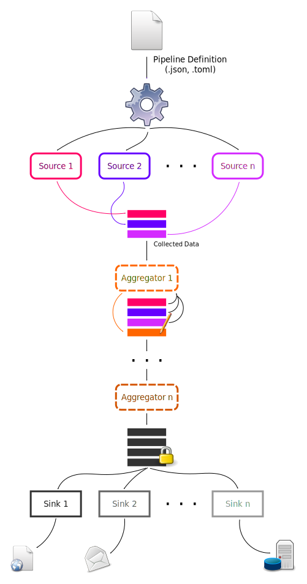

==========
Quickstart
==========

.. contents::
   :local:

Introduction
============

Flowbber is a configuration-based :term:`pipeline executor <Pipeline Executor>`
and framework written in Python 3 that allows to:

#. Collect data from many different sources concurrently.
#. Analyze and process the data.
#. Publish the data to many different data stores.

This can be accomplish in a very easy and flexible way, and enables many use
cases from several different domains.

Quick Installation
==================

Flowbber can be easily installed from PyPI_ using pip_:

.. code-block:: sh

    pip3 install flowbber

.. important::

    Flowbber is available for Python 3 only and tested in Python 3.5+.

.. _PyPI: https://pypi.python.org/pypi/flowbber
.. _pip: https://pip.pypa.io/en/stable/installing/

Verifying Installation
----------------------

Check that you can launch the ``flowbber`` command line application:

.. code-block:: console

    $ flowbber --version
    Flowbber v1.1.0

Help is available using the ``--help`` flag:

.. code-block:: console

    $ flowbber --help
    usage: flowbber [-h] [-v] [--version] pipeline

    Flowbber is a generic tool and framework that allows to execute custom
    pipelines for data gathering, publishing and analysis.

    positional arguments:
      pipeline       Pipeline definition file

    optional arguments:
      -h, --help     show this help message and exit
      -v, --verbose  Increase verbosity level
      --version      show program's version number and exit

Key Concepts
============

As a :term:`pipeline executor <Pipeline Executor>`, Flowbber provides the
``flowbber`` command line application which is responsible for loading a
textual :term:`pipeline definition <Pipeline Definition>` and execute the data
**collection**, **analysis** and **publishing** routines as defined.

The pipeline definition can be written in a simple JSON_ or TOML_ format, and
specifies the stages of your pipeline:

- :term:`Sources <Source>`: what data to collect and how.
- :term:`Aggregators <Aggregator>`: how to accumulate or process the collected
  data.
- :term:`Sinks <Sink>`: How to publish, store or transmit the resulting data.

As a framework, Flowbber allows to create the :term:`components <Component>`
(sources, aggregators and sinks) for your custom data pipeline in an easy and
straightforward way.

Flowbber will execute any pipeline in the following way:

   Execution of a Flowbber pipeline.

As shown in the diagram above, the list of :term:`sources <Source>` will be run
**concurrently**, each one in its own subprocess. Each source will provide some
arbitrary data that will be collected into a bundle that maps the identifier
of each source to the data it provided.

Sources are expected to connect, read, parse or consume a particular data
source, like a web service, a system statistic, read and / or parse a file,
fetch variables from the environment, scan a directory, among others examples.

Once all sources have run and all data have been collected into the bundle,
the list of :term:`aggregators <Aggregator>` will be run **sequentially**.

The entirety of the collected data will be passed to each aggregator, which is
allowed to produce more data based on the collected data, modify the data, or
even delete entries in the bundle.

Any data transformation is valid, and the modified data will be passed to the
next aggregator, making the order in which the aggregators run very important.

This behavior makes the aggregator the more flexible and powerful component of
the pipeline. Nevertheless, in many use cases only sources and sinks are
required. A valid pipeline requires at least one source and one sink, and thus
aggregators are optional.

Finally, when the last aggregator has run, the data will be considered done and
become read-only. The data is then passed to each :term:`sink <Sink>`, which
will also run **concurrently**, each one in its own subprocess.

Sinks can modify or transform the passed data at will if required, but those
modifications will have no effect in the data the others sinks have. It is
expected that the sinks store or publish the data in some form, for example
submitting it to a database, to a web service, writing a file, rendering a
template, sending it by email, among some examples.

Defining a Pipeline
===================

Let's run the simplest pipeline. Create a file ``pipeline1.toml`` with:

.. code-block:: toml

    [[sources]]
    type = "timestamp"
    id = "timestamp1"

    [[sinks]]
    type = "print"
    id = "print1"

And execute it with:

.. code-block:: console

    $ flowbber pipeline1.toml
    OrderedDict([('timestamp1', {'epoch': 1503697771})])

As you can see, the collected data is composed of an
:py:class:`collections.OrderedDict` that maps the ``id`` of a source to the
data it collected.

In this example, we use the :ref:`timestamp <sources-timestamp>` source, which
is a simple plugin that collects the current time. Then, we use the
:ref:`print <sinks-print>` sink, which is a simple plugin that pretty prints
the collected data to the standard output.

Let's add a couple more sources:

.. code-block:: toml

    [[sources]]
    type = "timestamp"
    id = "timestamp1"

    [[sources]]
    type = "timestamp"
    id = "timestamp2"

    [[sources]]
    type = "user"
    id = "user1"

    [[sinks]]
    type = "print"
    id = "print1"

And let's execute this new pipeline:

.. code-block:: console

    $ flowbber pipeline1.toml
    OrderedDict([
        ('timestamp1', {'epoch': 1503698275}),
        ('timestamp2', {'epoch': 1503698275}),
        ('user1', {'login': 'kuralabs', 'uid': 1000}),
    ])

Note that the ``timestamp`` sources picked the same integer timestamp in
seconds since the epoch. Let's configure them to use a floating point timestamp
that takes into account milliseconds:

.. code-block:: toml

    [[sources]]
    type = "timestamp"
    id = "timestamp1"

        [sources.config]
        epoch = false
        epochf = true

    [[sources]]
    type = "timestamp"
    id = "timestamp2"

        [sources.config]
        epoch = false
        epochf = true

    [[sources]]
    type = "user"
    id = "user1"

    [[sinks]]
    type = "print"
    id = "print1"

According to the :ref:`timestamp <sources-timestamp>` source you can use
several timestamp formats, and with the above options we toggle them.

When executed, the pipeline shows:

.. code-block:: console

    $ flowbber pipeline1.toml
    OrderedDict([
        ('timestamp1', {'epochf': 1503698656.83944}),
        ('timestamp2', {'epochf': 1503698656.840055}),
        ('user1', {'login': 'kuralabs', 'uid': 1000}),
    ])

Now, we can see that, as expected, both ``timestamp`` sources picked the
current time at slight different times.

As a final exercise, let's run the same pipeline again but with a bit of
verbosity:

.. code-block:: console

    $ flowbber -vv pipeline1.toml
      INFO     | flowbber PID 10300 starting ...
      INFO     | Loading pipeline definition from /home/kuralabs/flowbber/examples/basic/pipeline.toml ...
      INFO     | Pipeline definition loaded, realized and validated.
      INFO     | Loading local configuration from /home/kuralabs/flowbber/examples/basic ...
      INFO     | Creating pipeline ...
      INFO     | Loading plugins ...
      INFO     | Sources available: ['env', 'cpu', 'user', 'cobertura', 'speed', 'timestamp']
      INFO     | Aggregators available: []
      INFO     | Sinks available: ['mongodb', 'influxdb', 'archive', 'print', 'template']
      INFO     | Building pipeline ...
      INFO     | Using configuration:
        epoch = False
        epochf = True
        iso8601 = False
        strftime = None
      INFO     | Created source instance #0 TimestampSource.timestamp.timestamp1
      INFO     | Using configuration:
        epoch = False
        epochf = True
        iso8601 = False
        strftime = None
      INFO     | Created source instance #1 TimestampSource.timestamp.timestamp2
      INFO     | Created source instance #2 UserSource.user.user1
      INFO     | Created sink instance #0 PrintSink.print.print1
      INFO     | Running pipeline ...
      INFO     | Running sources ...
      INFO     | Starting source #0 "timestamp1"
      INFO     | Starting source #1 "timestamp2"
      INFO     | Starting source #2 "user1"
      INFO     | Joining source #0 "timestamp1"
      INFO     | Source #0 "timestamp1" (PID 10308) finished successfully after 0.0001 seconds
      INFO     | Joining source #1 "timestamp2"
      INFO     | Source #1 "timestamp2" (PID 10310) finished successfully after 0.0004 seconds
      INFO     | Joining source #2 "user1"
      INFO     | Source #2 "user1" (PID 10312) finished successfully after 0.0001 seconds
      INFO     | Running aggregators ...
      INFO     | Running sinks ...
      INFO     | Starting sink #0 "print1"
      INFO     | Joining sink #0 "print1"
    OrderedDict([
        ('timestamp1', {'epochf': 1504829040.032091}),
        ('timestamp2', {'epochf': 1504829040.036981}),
        ('user1', {'login': 'kuralabs', 'uid': 1000}),
    ])
      INFO     | Sink #0 "print1" (PID 10314) finished successfully after 0.0016 seconds
      INFO     | Saving journal ...
      INFO     | Journal saved to /tmp/flowbber-journals/journal-10300-6dgy3f5w

As we can see, a lot of information is provided, including configuration and
duration of each source, plugins available, PIDs, etc.

At this point we have covered the basics. In this example we used TOML_ to
define the pipeline, but JSON_ can also be used, as explained in the following
section.

Optional Execution and Timeout
==============================

.. versionadded:: 1.1.0

In some situations some components of a pipeline may fail. By default, if any
component fails to perform its programming the pipeline will fail right away.

Nevertheless, any component can be marked as **optional** (allowed or expected
to fail), which means that if it fails or crashes, a warning will be logged and
the pipeline can continue executing.

For sources, this means that the following stages (aggregators and sinks) must
be able to handle the possible absence of the data provided by the failed
source. For example, in a template sink, the template should ask first if the
id of the optional source is present in the final bundle before plotting its
data.

For aggregators, this means that the input data for the next aggregator will be
unmodified from the one received by the failed aggregator.

For sinks, it just means that if a sink fails, the pipeline won't crash right
away. In many cases, it is recommended to mark all your sinks as optional,
at least to retain most of the data even if the pipeline failed to submit it in
one form.

In the same way, in some situations the gathering of data from a particular
data store, the processing of such data or the publication of the final bundle
can take a lot of time. In some sources, it doesn't even makes sense to wait
for the data to be collected as it has lost its value if it is not collected in
a particular time frame.

For this use cases, and to avoid pipeline deadlocks, any component can be setup
to execute in a specific timeframe. This **timeout** is either a time
expression (str) or seconds (float) (see :ref:`frequency <frequency>` for
format) that marks the maximum time the component is allowed to run.

If the component exceeds its allowed time frame the pipeline executor will kill
the driving process and mark the component as failed. Depending on the
**optional** value the pipeline will then crash or continue executing.

Pipeline Definition Format
==========================

Flowbber supports both TOML_ and JSON_ formats for pipeline definition. For the
format to be recognized by Flowbber, use either a ``.toml`` or ``.json`` file
extension.

In both formats, what is expected is that the pipeline is described in terms
of:

- A list of :term:`sources <Source>`.
- An optional list of :term:`aggregators <Aggregator>`.
- And a list of  :term:`sinks <Sink>`.

And each element of those lists, to have:

- A **type**, that identifies the component implementation.
- A unique **id** to identify the instance.
- A **config**, if any, as required by the component implementation.

And optionally:

.. versionadded:: 1.1.0

- An **optional** flag that marks if the component is allowed to fail or not.
- An execution **timeout** for this component, either a time expression (str)
  or seconds (float) (see :ref:`frequency <frequency>` for format).

All keys, and in particular those of the configuration options must be able to
be used as Python variables, so they are checked against the following regular
expression:

.. code-block:: python3

    r'^[a-zA-Z][a-zA-Z0-9_]*$'

JSON
----

.. code-block:: json

  {
      "sources": [
          {
              "type": "type1",
              "id": "id1",
              "config": {
                  "opt1": true,
                  "opt2": "string",
                  "opt3": 1000
              }
          },
          {
              "type": "type2",
              "id": "id2",
              "config": {},
              "optional": true,
              "timeout": 60
          }
      ],
      "aggregators": [
          {
              "type": "type1",
              "id": "id1",
              "timeout": "1.5 min"
          }
      ],
      "sinks": [
          {
              "type": "type1",
              "id": "id1",
              "config": {}
          },
          {
              "type": "type2",
              "id": "id2",
              "config": {
                  "opt1": true,
                  "opt2": "string",
                  "opt3": 1000
              }
          }
      ]
  }

TOML
----

Please note that in TOML, lists of objects are represented with a double square
bracket ``[[ElementInList]]``.

.. code-block:: toml

    [[sources]]
    type = "type1"
    id = "id1"

        [sources.config]
        opt1 = true
        opt2 = "string"
        opt3 = 1000

    [[sources]]
    type = "type2"
    id = "id2"
    optional = true
    timeout = 60

    [[aggregators]]
    type = "type1"
    id = "id1"
    timeout = "1.2 min"

    [[sinks]]
    type = "type1"
    id = "id1"

    [[sinks]]
    type = "type2"
    id = "id2"

        [sources.config]
        opt1 = true
        opt2 = "string"
        opt3 = 1000

Substitutions
=============

Key - value settings in a :term:`Pipeline Definition` file can make use of
value substitution through the ``{namespace.value}`` string-substitution
pattern. Substitutions can only be applied to **strings**.

For example:

In JSON:

.. code-block:: json

    {
        "sinks": [
            {
                "type": "template",
                "id": "template1",
                "config": {
                    "template": "file://{pipeline.dir}/template1.tpl"
                }
            }
        ]
    }

In TOML:

.. code-block:: toml

    [[sinks]]
    type = "template"
    id = "template1"

        [sinks.config]
        template = "file://{pipeline.dir}/template1.tpl"

If the ``{`` or ``}`` characters are required they can be escaped using a
double bracket. For example ``{{{env.HOME}}}{{`` will result in
``{/home/kuralabs}{``.

Available Namespaces
--------------------

``env``
    You may retrieve any environment variable from this namespace.

    For example::

        {env.HOME}

    .. warning::

        For execution safety and because :py:func:`collections.namedtuple`
        doesn't support attributes that start with a `_` (underscore), any
        environment variable name that doesn't match the following regular
        expression will be filtered out:

          ``^[a-zA-Z][a-zA-Z0-9_]*$``

    .. warning::

        From a security perspective, if secrets are passed as environment
        variables this namespace may constitutes a way to expose them.

``pipeline``
    Information related to the input :term:`Pipeline Definition` file. This is
    particularly useful for specifying paths that must remain relative to the
    pipeline definition file.

    For example, a template:

    .. code-block:: toml

        [[sinks]]
        type = "template"
        id = "template1"

            [sinks.config]
            template = "file://{pipeline.dir}/template1.tpl"

    ``dir``
        Parent directory of the input pipeline definition file.

    ``ext``
        Extension of the input pipeline definition file. Should be
        either ``.toml`` or ``.json``.

    ``file``
        Filename of the pipeline definition file.
        For example ``pipeline1.toml``.

    ``name``
        Filename of the pipeline definition file without extension.
        For example, ``pipeline1`` for a input file ``pipeline1.toml``.

``git``
    Information related to git repository the input :term:`Pipeline Definition`
    file is committed to, if any. This is particularly useful for specifying
    paths that must remain relative to git root repository.

    For example, a path to a code directory:

    .. code-block:: toml

        [[sources]]
        type = "linesofcode"
        id = "linesofcode1"

            [sources.config]
            directory = "{git.root}/src/"

    In case the input pipeline definition file isn't in a git repository, this
    namespace will be set to ``None``, causing any reference to an attribute in
    it to fail.

    ``root``
        Repository root directory.

        This is determined by:

        .. code-block:: sh

            git -C pipeline.parent rev-parse --show-toplevel

    ``branch``
        Name of the current branch. For example: ``master``.

        This is determined by:

        .. code-block:: sh

            git -C pipeline.parent rev-parse --abbrev-ref HEAD

    ``rev``
        Current revision hash in short format.

        This is determined by:

        .. code-block:: sh

            git -C pipeline.parent rev-parse --short --verify HEAD

Scheduling
==========

In many use cases it is required to keep running the pipeline with some
frequency.

For example, consider you want to monitor your Internet speed. You want to
collect a sample once per hour and send it to a time series database for later
retrieval and visualization.

The obvious solution is to configure your system's ``cron`` to call the
``flowbber`` command line application once per hour. While this approach is
useful, effective and supported, Flowbber has a built-in scheduler that allows
to configure scheduling directly from the pipeline definition file and provides
more advanced features that cron can't provide.

To use the scheduling feature just include a ``schedule`` section as follows:

In TOML:

.. code-block:: toml

    [schedule]
    frequency = "10 seconds"
    start = 1503741210
    samples = 4
    stop_on_failure = true

In JSON:

.. code-block:: json

    {
        "schedule": {
            "frequency": "10 seconds",
            "start": 1503741210,
            "samples": 4,
            "stop_on_failure": true
        }
    }

Options are:

.. _frequency:

``frequency``
    String expression denoting a time frequency or a float expressing the
    period in seconds.

    The time frequency string is parsed using the pytimeparse_ library and
    thus the following expressions can be used:

    .. code-block:: text

        0.1 second
        1s
        10 minutes
        10:20:10
        2 days, 4:13:02
        5 hours, 34 minutes, 56 seconds

    For a complete list of time expressions please visit the pytimeparse_
    library.

    .. _pytimeparse: https://github.com/wroberts/pytimeparse

``samples``
    Number of samples (successful executions of the pipeline) to take before
    shutting down.

    If missing or ``None``, the scheduler will continue taking samples forever.

``start``
    An absolute timestamp in seconds since the epoch that mark when the
    scheduler should start executing the pipeline. This timestamp must be in
    the future.

    If missing or ``None``, the scheduler will start immediately.

``stop_on_failure``
    Stop the execution of the scheduler if a pipeline execution fails.

Glossary
========

.. glossary::

    Pipeline
        A chain of data-processing stages. A Flowbber Pipeline must contain at
        least one :term:`Source` and one :term:`Sink`.

    Pipeline Definition
        A file or data structure describing the stages and
        :term:`Components <Component>` of a :term:`Pipeline` and its
        configuration.

    Pipeline Executor
        An application responsible of executing a :term:`Pipeline`.

    Source
        A type of :term:`Component` that is responsible for collecting data
        from a particular data source.

    Aggregator
        A type of :term:`Component` that is responsible for analyzing,
        relating, accumulate or process the data collected by the
        :term:`Sources <Source>`.

    Sink
        A type of :term:`Component` that is responsible for publishing the data
        collected to a particular data store.

    Plugin
        A modular :term:`Component` that performs a very specific task and was
        created for a single purpose. It is usually packaged and distributed
        apart.

    Component
        A component of a stage in a :term:`Pipeline`. Either a :term:`Source`,
        an :term:`Aggregator` or a :term:`Sink`.

.. _JSON: http://www.json.org/
.. _TOML: https://github.com/toml-lang/toml
